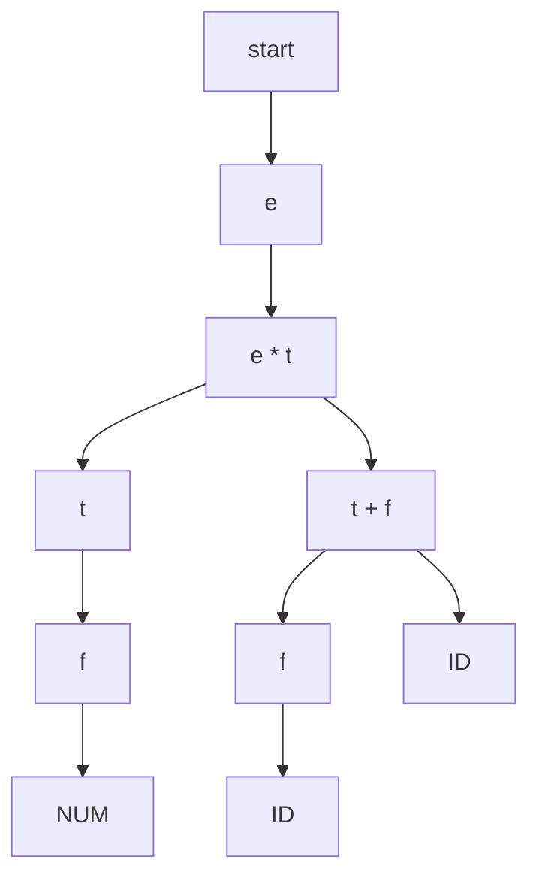
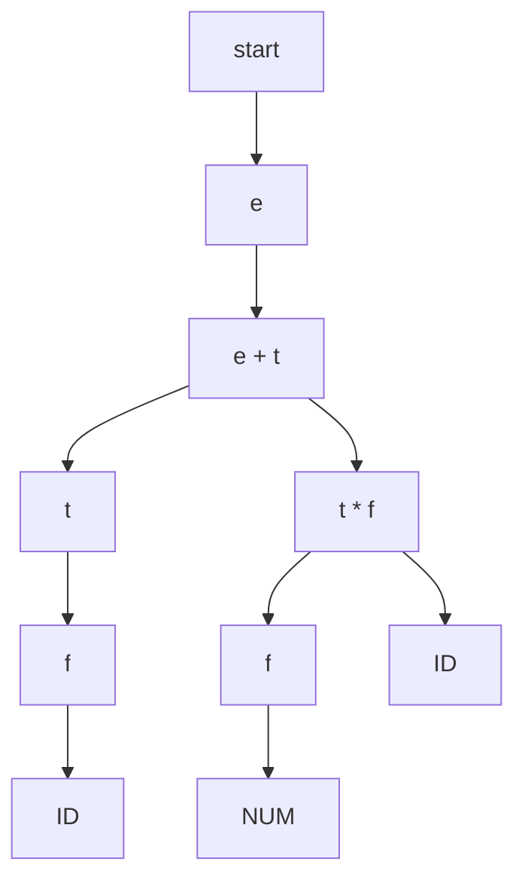

**Goal** - Match the stream of tokens to the grammar of the programming language. If it's valid return an abstract syntax tree. 
**Input** - A stream of tokens
**Output** - Abstract Syntax tree

Checks the high-level structure of a program, meaning that it checks if the code follows the rules of the programming language. It does this by looking at the stream of tokens and makes sure that there aren't any illegal token combinations. 

`x = ;` $\leftarrow$ Illegal. 
- IDENTIFIER
- OP_ASSIGN
- <s> NUMBER </s> $\leftarrow$ This token is needed to make legal.
- SEMICOLON

`10 * x + y;`
- NUMBER
- TOKEN_MUL
- ID
- TOKEN_PLUS
- ID
- SEMICOLON

Abstract Syntax tree of 10 * x + y ; 

x + 3 * y
